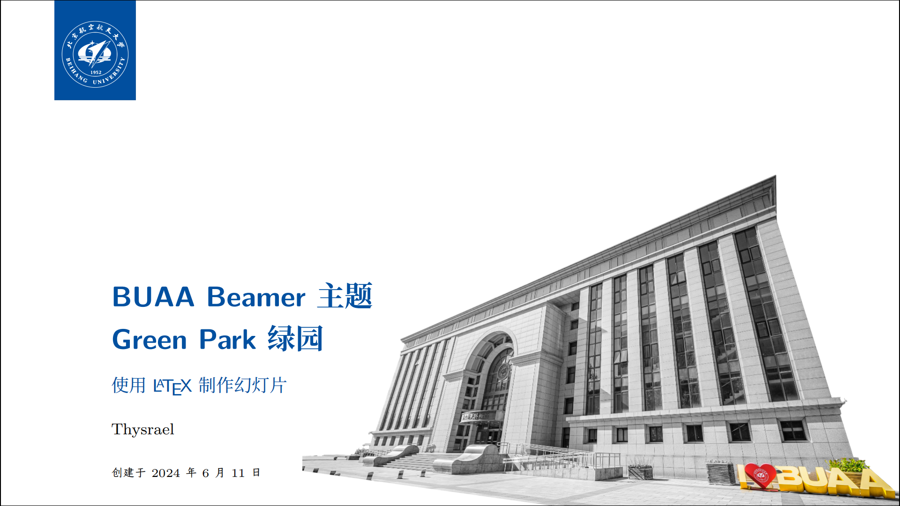
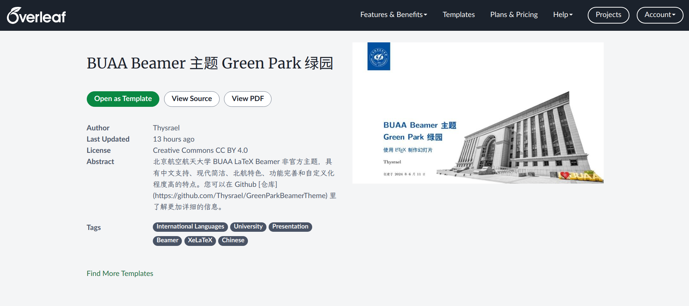

# Green Park 绿园



Green Park 是北航六系开发的一款非官方的 LaTeX Beamer 中文主题，具有如下特点：

- 中文支持
- 简洁现代
- 北航特色
- 功能完善
- 自定义化程度高

关于该主题的展示，可以参考该[示例文件](./misc/example.pdf)。

## Overleaf

考虑到本地搭建 LaTeX 环境的不易，我强烈建议使用 Overleaf 来制作 Beamer 。您可以在如下[网址](https://www.overleaf.com/latex/templates/buaa-beamer-zhu-ti-green-park-lu-yuan/mzjvbpbxhpmp)使用该主题。



不过 overleaf 可能更新不及时，如果你需要最新版，需要您手动上传 overleaf，为了确保字体存在，本主题需要修改 [beamerthemegpark.sty](./beamerthemegpark.sty) 中的部分内容。

``` latex
%%%%%%%%%%%%%%%%%% BEFORE %%%%%%%%%%%%%%%%%%%%%%%%
\setmainfont{Times New Roman} % 英文字体
\setCJKmainfont{TsangerJinKai05} % 正文字体
\setCJKsansfont{Source Han Serif CN} % 标题字体
% TODO: minted 无法使用指定的等宽字体
\setCJKmonofont{JetBrainsMono Nerd Font Mono} % 等宽字体
\RequirePackage{amsfonts, amsmath, oldgerm, lmodern, bm} % 数学相关的字体
\let\songti\relax
\let\heiti\relax
\setCJKfamilyfont{heiti}[AutoFakeBold = {2.17}]{Source Han Serif CN}
\setCJKfamilyfont{hwxingkai}[AutoFakeBold = {2.17}]{STXingkai}
\newcommand{\heiti}{\CJKfamily{heiti}}
\newcommand{\hwxingkai}{\CJKfamily{hwxingkai}}

%%%%%%%%%%%%%%%%%% AFTER %%%%%%%%%%%%%%%%%%%%%%%%
\setmainfont{Times New Roman} % 英文字体
\setCJKmainfont{FandolFang} % 正文字体
\setCJKsansfont{FandolHei} % 标题字体
% TODO: minted 无法使用指定的等宽字体
% \setCJKmonofont{JetBrainsMono Nerd Font Mono} % 等宽字体
\RequirePackage{amsfonts, amsmath, oldgerm, lmodern, bm} % 数学相关的字体
\let\songti\relax
\let\heiti\relax
\setCJKfamilyfont{heiti}[AutoFakeBold = {2.17}]{FandolHei}
\setCJKfamilyfont{hwxingkai}[AutoFakeBold = {2.17}]{FandolKai}
\newcommand{\heiti}{\CJKfamily{heiti}}
\newcommand{\hwxingkai}{\CJKfamily{hwxingkai}}
```

本仓库体积较大，可以考虑删除 `misc` 文件夹，即可上传 Overleaf 。

需要在 Overleaf 左上角菜单处将编译器设置成 `XeLaTeX` 方可通过中文编译。

## 依赖

- 构建依赖：`XeLaTeX`
- 字体依赖：`Times New Roman`，`TsangerJinKai05`，`Source Han Serif CN`，`JetBrainsMono Nerd Font Mono`，`STXingkai`
- 代码高亮依赖：`pygmentize`（可选）


## 构建

当依赖安装后，克隆该仓库并在根目录下使用如下命令即可构建 Beamer：

```shell
make
```

这条命令会将 `main.tex` 这个文件编译成 `main.pdf` 。

如果您希望在其他 Beamer LaTeX 文件中使用此主题，可以将 [beamerthemegpark.sty](./beamerthemegpark.sty) 和 [gparkcolor.sty](./gparkcolor.sty) 这两个文件复制到 LaTeX 文件所在的目录，然后编译即可。


## 自定义

Green Park 支持极高程度的自定义，您可以通过简单的修改打造出适合自己的 Beamer 主题：

- 主题颜色：修改 [gparkcolor.sty](./gparkcolor.sty) 中的 `sintefblue` 来改变主题颜色
- 样式颜色：修改 [gparkcolor.sty](./gparkcolor.sty) 中的 `airforceblue, emphred, morelightgray, sintefgrey`  来改变样式颜色
- 校徽：修改 [images/logo.png](./images/logo.png) 和 [images/logo_negative.png](./images/logo_negativepng) 来改变校徽，其中校徽的颜色与主题颜色保持一致较为美观
- 首页背景：在 [main.tex](./main.tex) 中使用 `\titlebackground{<background_path>}` 来指定首页背景
- 正文背景：在 [main.tex](./main.tex) 中使用 `\background{<background_path>}` 来指定正文背景
- 字体：修改 [beamerthemegpark.sty](./beamerthemegpark.sty) 中的 `setmainfont, setCJKmainfont, setCJKsansfont, setCJKfamilyfont` 命令来修改字体。


## 开发

目前 Green Park 完成了初版，后续会考虑调整字体细节和上传 Overleaf。考虑到该主题代码量约 500 行，十分适合进一步修改，欢迎大家提 Issue 或者 PR。

对于图片的设计，我个人也是小白，是找的网上的抠图网站，后期的处理是使用的 WPS PPT 。我在 [misc](./misc/) 下存放了我使用到的素材和加工 PPT 。

如果有共同建设 Green Park 主题意愿的开发者（北航之前的 Beamer 主题没有现代风格的），可以在 Issue 或者项目中搜索 `TODO` 来查询现有的不足。


## 声明

GreenPark 绿园是基于 [SINTEF Presentation](https://www.overleaf.com/latex/templates/sintef-presentation/jhbhdffczpnx) 和 [Beamer-LaTeX-Themes](https://github.com/liu-qilong/Beamer-LaTeX-Themes) 的二次开发，GreenPark 去掉了 SINTEF 的一些 deprecated 特征，并增加了中文支持。感谢这些开发者高品味和优雅的设计。封面素材来自北航姜海洋同学的摄影作品。背景图片来自北航新闻中心，均已取得相关授权。感谢他们的慷慨。

本主题采用 [CC-BY-4.0](https://creativecommons.org/licenses/by/4.0/deed.zh-hans)，您可以自由地共享和演绎，只需要给出适当的署名。
